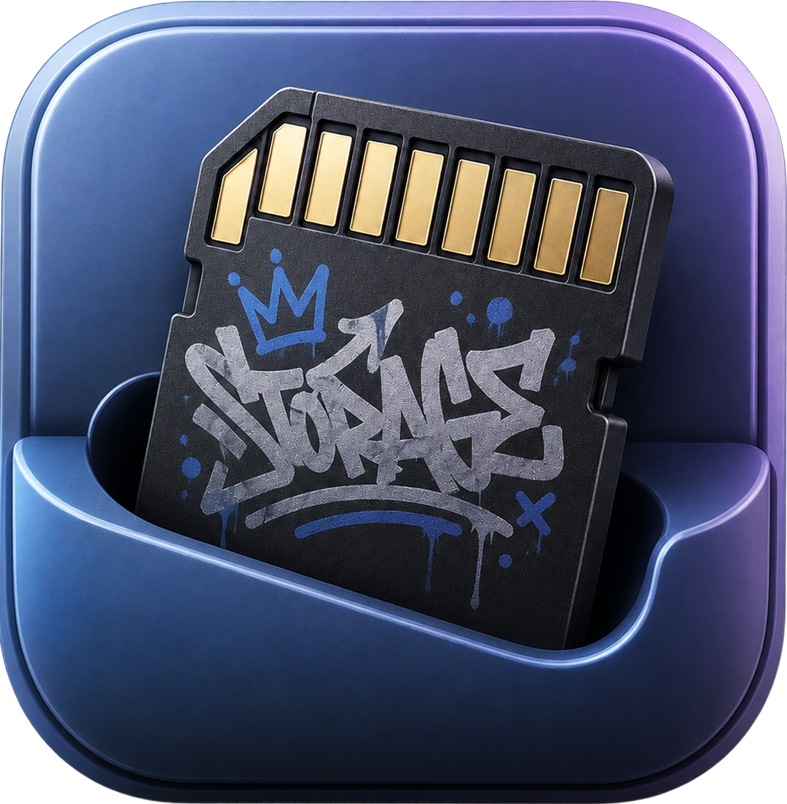

<p align="center">
  
</p>

<h1 align="center">cardgrab</h1>

<p align="center">
  The fastest way to get photos and video off your camera card on a Mac.
</p>

---

**cardgrab** is what Image Capture should have been in 2026. It pulls everything off your SD card — including the video files Image Capture quietly skips — at full reader speed, organizes them into folders you'll actually find later, and stays out of your way.

## Why this exists

macOS ships Image Capture, but on a Sony card it skips the `PRIVATE/M4ROOT/CLIP/` video folder, ignores `.XML` and `.THM` sidecars, and doesn't handle XAVC variants well. Most pro photographers end up doing two manual passes — Image Capture for stills, Finder drag for video — and losing folder organization in the process.

cardgrab does one thing: it ingests **everything** on your card, fast, with sensible folders.

## Highlights

- **Handles every file your camera writes.** DCIM, `PRIVATE/M4ROOT` (XAVC HD/HS/S), `MP_ROOT`, AVCHD, sidecar XML/THM. Photos, RAW, MP4, MXF, MTS, audio — all of it.
- **Fast.** Kernel-level copy via macOS `fcopyfile`, 4 concurrent workers by default. Saturates UHS-II readers.
- **Real thumbnails for everything.** Photos, RAW, video poster frames — all rendered via macOS Quick Look so the previews actually match what you shot.
- **Browse before you import.** Searchable grid grouped by shoot date, click to select/deselect, shift-click for range, ⌘A toggles select-all.
- **Dead-simple folder layout.** One folder per shoot date by default. Custom templates (`{camera}`, `{lens}`, `{date}`, `{ext}`) if you want them.
- **Doesn't touch your card.** The transfer engine refuses to write to the same volume as the source. Format the card yourself, in-camera, when you're done.
- **Direct camera mode.** Plug a Sony/Canon/Fuji body in via USB and ingest over PTP (needs `gphoto2` — `brew install gphoto2`).
- **Local import journal.** Every file copy logged in SQLite with a full audit trail. Re-import or re-upload anytime.

## Install

### macOS

Grab the latest `.dmg` from the [Releases](../../releases) page.

The app isn't notarized yet, so the first launch needs right-click → Open. (Or run `xattr -dr com.apple.quarantine /Applications/cardgrab.app` after dragging it in.)

### Build from source

Requires:
- [Rust](https://rustup.rs) (stable)
- Node 20+
- The [Tauri prerequisites](https://tauri.app/start/prerequisites/) for your platform

```bash
git clone https://github.com/YOUR_USERNAME/cardgrab
cd cardgrab
npm install
npm run tauri dev      # development
npm run tauri build    # produces a .dmg in src-tauri/target/release/bundle/
```

Optional for direct-camera (PTP) ingest:
```bash
brew install gphoto2
```

## Folder templates

The default template is `{date}` — one folder per shoot date, everything in it. Available variables:

| Variable      | Example                |
|---------------|------------------------|
| `{year}`      | `2026`                 |
| `{month}`     | `05`                   |
| `{day}`       | `17`                   |
| `{date}`      | `2026-05-17`           |
| `{time}`      | `15-42-08`             |
| `{camera}`    | `ILCE-7M4`             |
| `{lens}`      | `FE 24-70mm F2.8 GM II`|
| `{kind}`      | `Photos`, `Videos`, `Raw` |
| `{ext}`       | `arw`                  |
| `{orig_name}` | `DSC04231.ARW`         |

Edit the template per-import or save your own in Settings.

## Stack

- **Tauri 2** — Rust core, native macOS window
- **Svelte 5 + Vite** — frontend
- **SQLite** (rusqlite) — settings + import journal
- **macOS `qlmanage`** — thumbnails for any file format the OS understands
- **macOS `fcopyfile`** (via `std::fs::copy` in a blocking task) — fast file copy
- **`gphoto2`** (optional) — direct camera ingest via USB-PTP

## Roadmap

- [ ] Notarized Mac builds (`.dmg` opens without Gatekeeper warnings)
- [ ] Windows build (the Rust core is portable; needs a different volume-watcher and PTP path)
- [ ] More camera support (Canon CR3, Fuji RAF EXIF quirks)
- [ ] Cloud destinations (point at a Google Drive / iCloud-synced folder; rclone integration later)
- [ ] Watch-folder mode (auto-ingest when a known card mounts)

## Contributing

Issues and PRs welcome. This project values:
- Native-feel macOS UI (Settings.app fidelity, no Material Design)
- Zero clicks for the happy path
- Never destructive — the card is read-only as far as cardgrab is concerned

## License

MIT — see [LICENSE](LICENSE).
